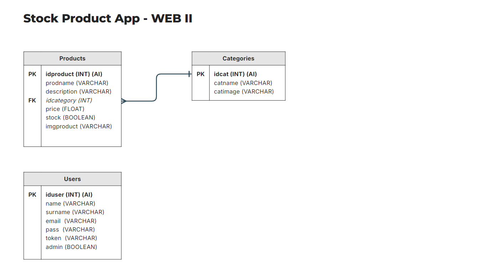

# App de Gestión de Productos y Categorías

### Autor
Gabriel Marrero (gab.bmar.05@gmail.com)

## Temática
Aplicación web desarrollada para llevar el registro, control y gestión de diversos productos en stock.

## Descripción de la temática
La aplicación web permitirá a los usuarios realizar una serie de acciones determinadas según el tipo de usuario al que pertenezcan para gestionar productos y categorías, desde lecturas, creación, actualización y eliminación.

Todos los usuarios contarán con el acceso a una vista de home, lista de productos, lista de categorías y vista de detalle de producto.
Sin embargo, en el caso de los usuarios administradores, contarán además con la posibilidad de loguearse y realizar operaciones CRUD (Crear, Leer, Actualizar, Eliminar) sobre los productos y categorías, mientras que los usuarios no administradores accederán solo a lecturas de productos y categorías, vista de detalle de producto específico y filtros de búsqueda de productos ya predeterminados por categorías.

## Funcionalidades
**Funcionalidades disponibles para usuarios no administradores**

    - Vista de Home.
    - Vista de lista de productos.
    - Vista de lista de categorías.
    - Vista de detalle de producto mediante ID.
    - Vista de formulario de login.

**Funcionalidades disponibles para usuarios administradores**

    - Vista de formulario de creación de producto.
    - Vista de lista de productos con accesos a: creación, actualización y eliminación.
    - Vista de lista de categorías con accesos a: creación, actualización y eliminación.
    - Vista de formulario de actualización de producto.
    - Vista de formulario de creación de categoría.
    - Vista de formulario de actualización de categoría.

## Estructura del proyecto
El proyecto se estructura en las siguientes carpetas:

* _stock-product-app:_ carpeta padre que contiene el proyecto completo.
* _app:_ carpeta que contiene los folder de modelos, controladores y vistas.
* _model:_ carpeta que contiene los modelos de datos.
* _controller:_ carpeta que contiene los controladores de la aplicación.
* _view:_ carpeta que contiene las vistas de la aplicación.
* _config:_ contiene archivo de configuración que almacena las constantes pertenecientes a la conexión con la DB.
* _data:_ carpeta que contiene el código SQL para la creación de la base de datos y diagrama DER.
* _libs:_ carpeta que contiene todos los archivos importados por la librería Smarty.
* _templates:_ carpeta que almacena todos los archivos de vistas como vista de home, formularios, vistas de listas, vista de detalle y todo lo relacionado a HTML.
* _styles:_ carpeta que contiene el archivo de estilos de la aplicación.
* _archivos:_ el proyecto también contiene archivos de configuración para la utilización de rutas semánticas como el router.php, .htaccess y BASE_URL.

## Herramientas y tecnologías
- PHP
- MySQL
- HTML
- CSS
- Smarty
- JavaScript

## Diagrama de Entidad-Relación

### Imagen

## Pruebas

Para probar las funcionalidades, puede utilizar los siguientes datos de usuario si no desea crear uno nuevo:
_User: webadmin@admin.com_
_Password: admin_